# Giztrack Architecture Roadmap

This guide explains the architectural core of Giztrack in a visual, interview-friendly way.
Use it to understand how the app is structured, how requests move through the system,
where the important business rules live, and how to talk about the design tradeoffs.

## 1. One-Sentence System Definition

Giztrack is a multi-tenant SaaS application for electronics repair shops, combining POS,
inventory, repairs, procurement, expenses, reports, staff permissions, and Paystack
subscription billing in one dashboard.

## 2. Big Picture

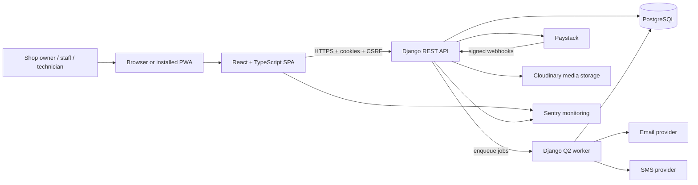

Interview explanation:

> The app has a React frontend and a Django REST backend. The backend is a modular
> monolith: one deployable Django service, but separated internally into domain apps
> like sales, inventory, repairs, subscriptions, and reports. PostgreSQL is the system
> of record. Background tasks run through Django Q2. External integrations include
> Paystack for billing, email/SMS for notifications, Cloudinary for media, and Sentry
> for monitoring.

## 3. Why This Is A Modular Monolith

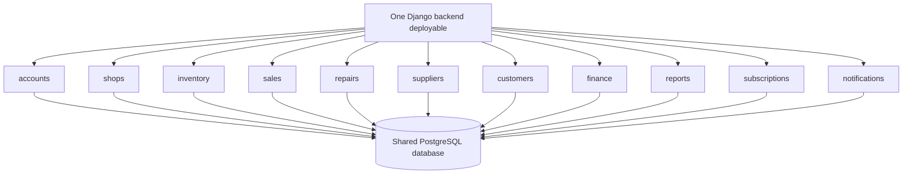

How to explain it:

> It is not microservices. It is a modular monolith. Each business domain has its own
> Django app, models, serializers, views, tests, and URLs, but everything runs inside
> one backend process and one database. That keeps deployment simple and makes
> cross-domain database transactions easier.

Tradeoff:

- Good: easier deployment, simpler debugging, strong database transactions, lower cost.
- Bad: one backend release affects the whole API, and scaling is less granular than microservices.
- Future path: split only after a domain has independent traffic, team ownership, or scaling needs.

## 4. Runtime Architecture

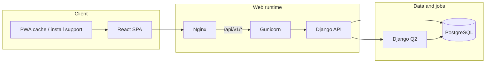

Production-like explanation:

> The built React app is served by Nginx. API requests are proxied to Gunicorn,
> which runs Django. Django reads and writes PostgreSQL. Long-running or scheduled
> tasks are handled by a separate Django Q2 worker process.

## 5. Request Lifecycle

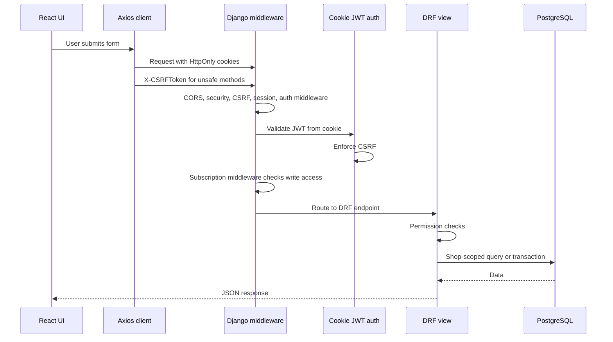

Key interview points:

- Tokens are stored in HttpOnly cookies, not localStorage.
- CSRF is required because cookies are sent automatically by browsers.
- Most API views require authentication by default.
- Write requests can be blocked if trial and subscription access are expired.
- Business data is scoped by `request.user.shop`.

Relevant code:

- `backend/utils/authentication.py`
- `backend/utils/middleware.py`
- `backend/utils/mixins.py`
- `frontend/src/api/axios.ts`

## 6. Tenant Isolation

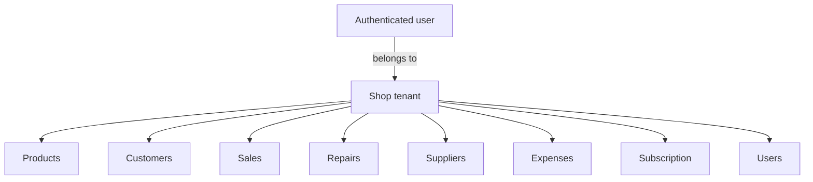

How it works:

> The shop is the tenant boundary. Each user belongs to one shop. Most business
> records have a `shop` foreign key. Shared helpers filter querysets by the current
> user's shop and inject that shop during creation.

Main risk to watch:

> Any new endpoint that forgets shop scoping can become a data leak. In interviews,
> mention that tenant scoping should be covered by tests for every new resource.

## 7. Domain Model Map

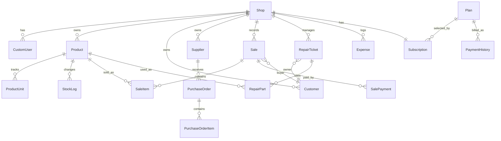

Data design principle:

> Operational entities point to the shop. Historical records snapshot important
> values such as product name, cost price, and sale price so old reports stay correct
> even after products are edited.

## 8. Sales Workflow

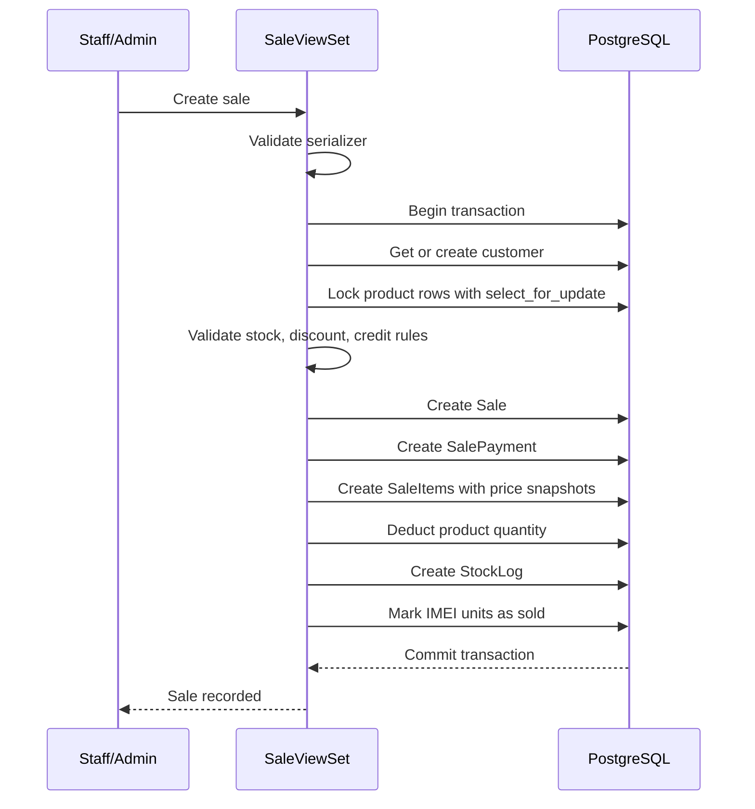

Why this matters:

> The sale workflow protects inventory consistency. It uses a database transaction
> so partial sales cannot be saved, and row locks prevent concurrent overselling.

Interview terms to use:

- ACID transaction
- row-level locking
- race condition
- atomic rollback
- immutable sales history
- stock ledger

## 9. Repair Workflow

```mermaid
flowchart LR
    Intake[Create repair ticket]
    Assign[Assign technician]
    Diagnose[Update status]
    Parts[Use inventory parts]
    Payment[Record payment]
    Fixed[Mark fixed]
    Notify[Notify customer]
    Collected[Customer collects device]

    Intake --> Assign
    Assign --> Diagnose
    Diagnose --> Parts
    Parts --> Payment
    Payment --> Fixed
    Fixed --> Notify
    Notify --> Collected
```

Important engineering idea:

> Repairs connect customer service with inventory. When parts are used, stock is
> deducted and a stock log is created. When a repair is marked fixed, notification
> work is pushed to Django Q2 instead of blocking the request.

## 10. Purchase Order And Inventory Flow

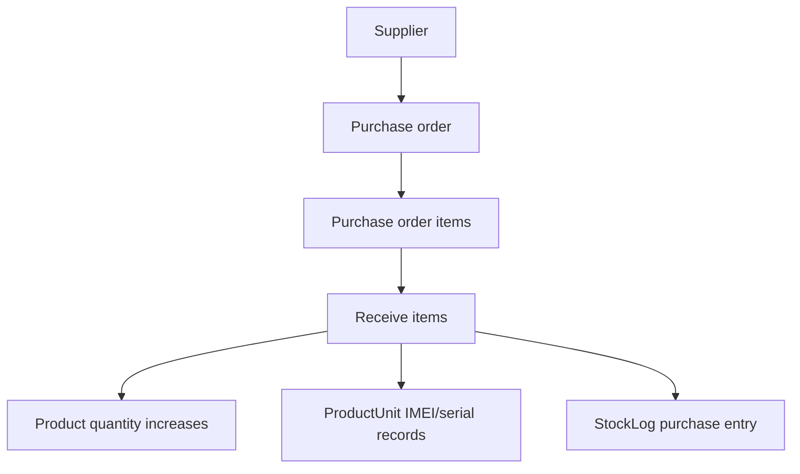

How to explain it:

> Inventory can increase through purchase-order receiving. The system updates the
> aggregate product quantity, optionally creates serialized unit records, and logs
> the stock movement for auditability.

## 11. Subscription And Billing Flow

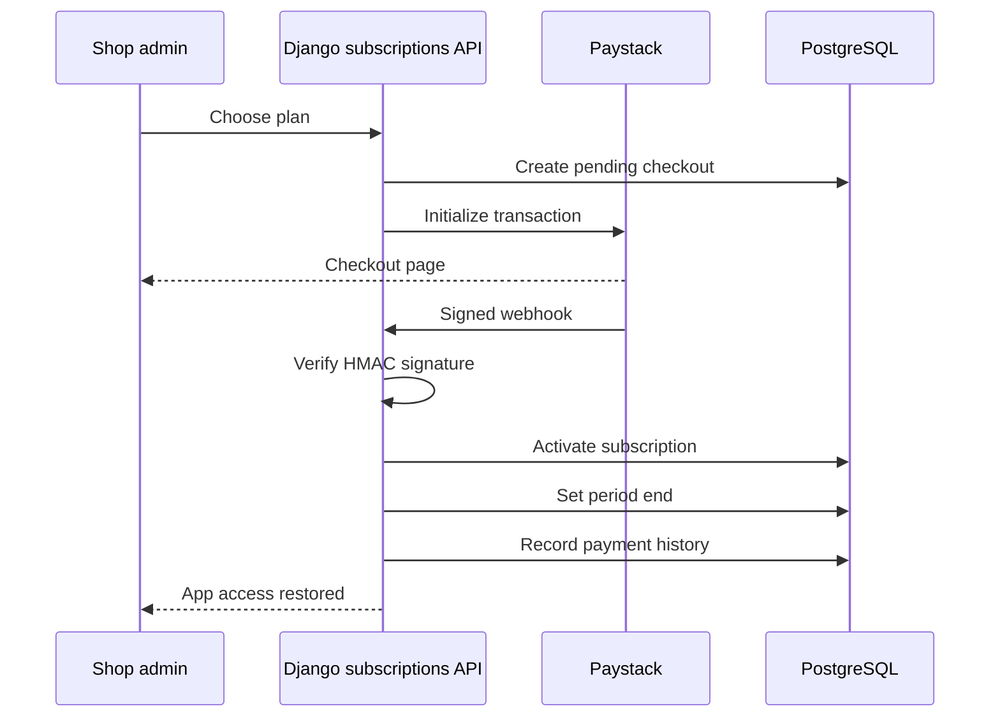

Auto-renewal recovery:

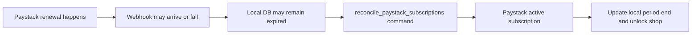

Interview explanation:

> Webhooks are the normal source of truth for payment events, but webhooks can be
> delayed, fail, or have payload differences between initial charge and renewal.
> The reconciliation command is an operational safety net. It compares local
> subscription records with Paystack and updates local access when the remote
> subscription is active.

## 12. Access Control Layers

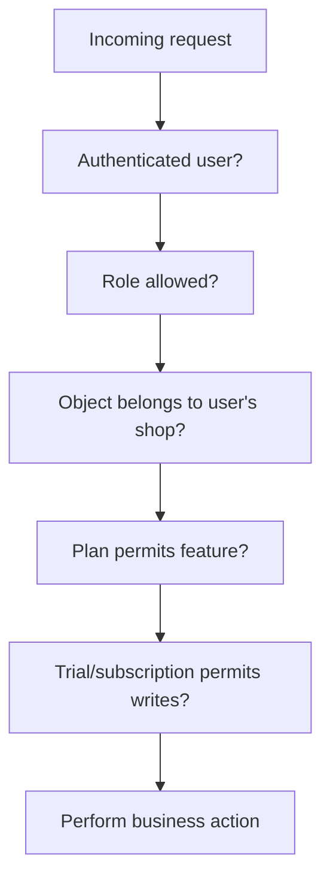

The layers are:

- Authentication: who are you?
- Role authorization: admin, staff, or technician?
- Tenant authorization: does this record belong to your shop?
- Plan authorization: Basic, Pro, or trial feature?
- Subscription access: can this shop still write data?

## 13. Reporting Architecture

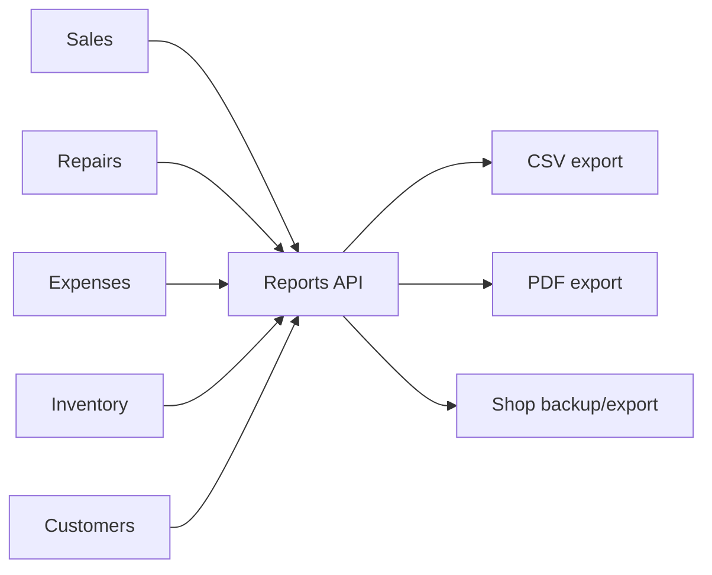

How to explain it:

> Reports are read models built from operational tables. The reports app does not
> own much data itself; it aggregates sales, repairs, expenses, inventory, and
> customers into summaries, charts, exports, and backups.

Scaling discussion:

- Current approach is fine for moderate data sizes.
- For larger shops, add indexes, query profiling, cached summaries, or reporting tables.
- At higher scale, move analytics into a data warehouse or asynchronous materialized reports.

## 14. Frontend Architecture

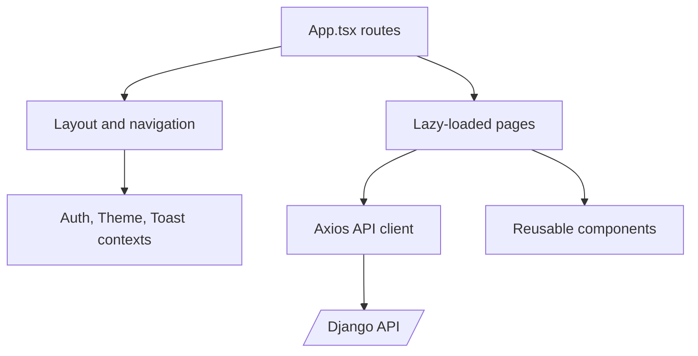

Key frontend ideas:

- React Router controls public and protected routes.
- Pages are lazy-loaded to reduce the initial bundle.
- Axios centralizes API base URL, cookies, CSRF, and token refresh.
- Auth context exposes role, plan, trial, and lock state.
- UI route protection helps user experience, but backend permissions remain the real security boundary.

## 15. Operational View

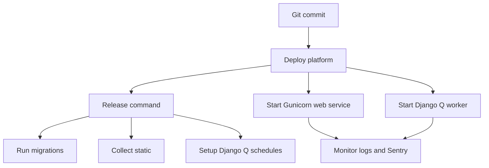

What to say in meetings:

> Deployment has two responsibilities: release preparation and runtime processes.
> Release preparation runs migrations, static collection, and schedule setup. Runtime
> starts the web server and worker. For subscription incidents, we can also run
> reconciliation as a controlled operational command.

## 16. Architecture Learning Roadmap

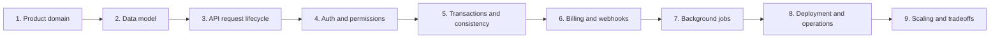

Study order:

1. Product domain: explain what problem the app solves for repair shops.
2. Data model: understand `Shop` as the tenant root.
3. API lifecycle: trace one request from React to Django to PostgreSQL.
4. Auth and permissions: explain cookies, CSRF, roles, plans, and tenant scoping.
5. Transactions: trace sale creation and stock deduction.
6. Billing: trace Paystack checkout, webhook, callback, and reconciliation.
7. Background jobs: understand notifications and schedules.
8. Deployment: understand Nginx, Gunicorn, PostgreSQL, and Django Q2.
9. Scaling: discuss bottlenecks and future improvements.

## 17. Interview Question Bank

### What architecture does this app use?

> It uses a React SPA plus a Django REST API. The backend is a modular monolith:
> one deployable backend, one database, but separated internally by Django apps for
> each business domain.

### Why not microservices?

> Microservices would add deployment, networking, observability, and data-consistency
> complexity before the product needs it. A modular monolith gives clean boundaries
> while keeping transactions and operations simpler.

### How do you isolate tenant data?

> Each user belongs to a shop, and business records belong to a shop. Querysets are
> filtered by the authenticated user's shop. This prevents cross-shop access.

### How do you prevent overselling stock?

> Sale creation runs in a database transaction and locks product rows with
> `select_for_update`. If validation fails, the entire transaction rolls back.

### Why use HttpOnly cookies for JWTs?

> HttpOnly cookies reduce the risk of JavaScript stealing tokens during XSS. Because
> cookies are automatically sent by browsers, the API also enforces CSRF protection.

### What happens if Paystack renewal succeeds but the app does not unlock the user?

> The normal path is a signed webhook updating the subscription period. If that path
> fails, the reconciliation command compares local records with Paystack and updates
> local access based on the active remote subscription.

### What would you improve next?

> I would add a durable webhook event inbox, more frontend tests, stricter dependency
> pinning, service-layer extraction for complex business workflows, and stronger
> reporting scalability through cached summaries or materialized reporting tables.

## 18. Mental Model To Keep

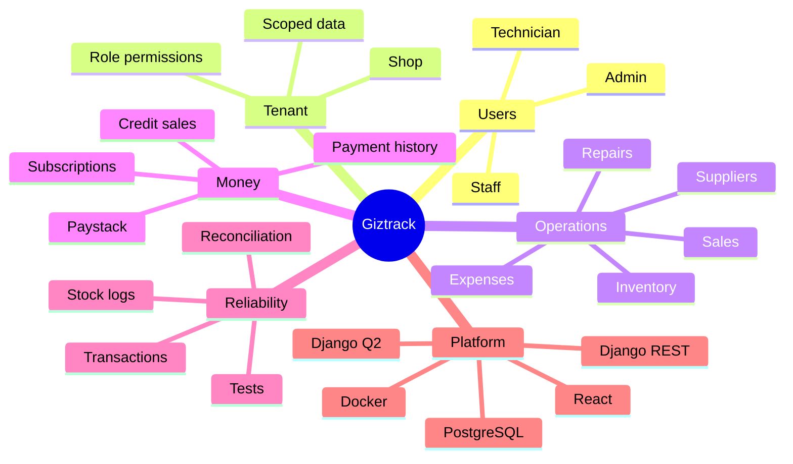

Final interview framing:

> I understand the app as a layered SaaS system. The frontend is responsible for
> user workflows. The API owns business rules. PostgreSQL is the source of truth.
> Shop scoping protects tenant data. Transactions protect inventory and money flows.
> Paystack and Django Q2 handle external billing and async work. The architecture is
> intentionally a modular monolith because that is the right complexity level for
> this product stage.

